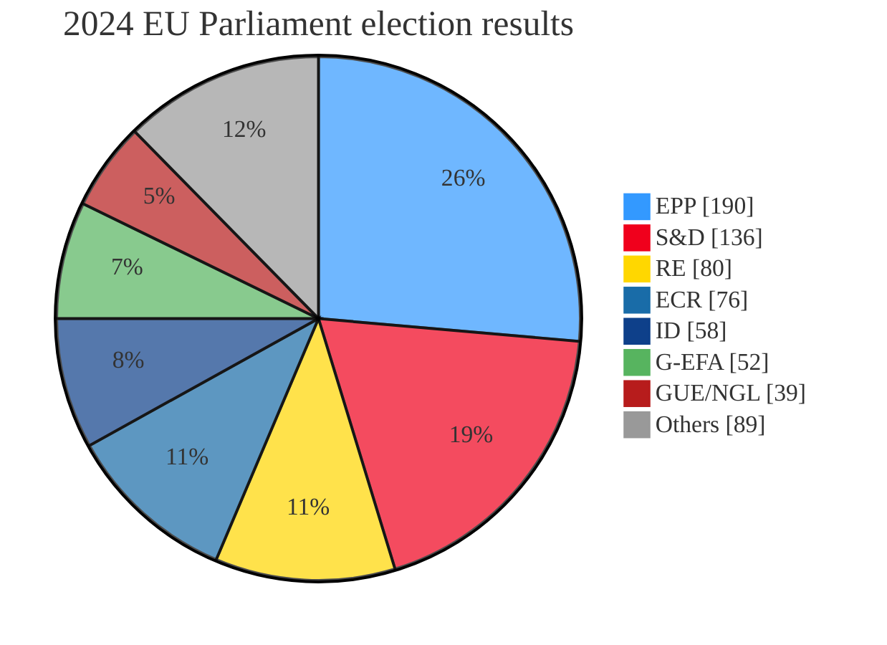


  A strategic foresight exercise for EU-China relations.



  **Note:** This exercise in strategic foresight was developed for my masters course on European Studies, during Spring 2024.



  Although this page is fully functional on mobile devices, its optimal layout is displayed on computer environments due to the use of the "card" element for the matrix presented.


## Introduction

China's near-obsession with Sino-American relations has become the centre-piece of its foreign policy. It appears as though China spends little of its energy thinking about Europe, in favour of what it frames as the **"most important bilateral relation in the world"**: that between itself and the United States. This choice of words, [proferred by Xi Jinping himself during remarks ahead 2023 bilateral talks on US soil](https://www.whitehouse.gov/briefing-room/speeches-remarks/2023/11/15/remarks-by-president-biden-and-president-xi-jinping-of-the-peoples-republic-of-china-before-bilateral-meeting-woodside-ca/), leaves little room for Europe. Accosted to the simpler days of transatlantic relations, Europe holds some resentment and (not so) silent disapproval towards the US's centre of gravity's shift from the cold North Atlantic via the Azores, to the sunny shores and vast expanse of the Pacific via Hawaii.

However, the US and China do not coexist alone in the blue marble. Europe, too, remains in the equation — a pawn for some, an asset for others, an actor in its own right or a burden for its friends. This fact guides the following exercise. What, then, is Europe to do about its future? This exercise in strategic foresight aims to provide a narrow framework through which to understand what stakes are at play for the Old Continent in an age where the upstart China wields its claim to equality among powers. It attempts to offer a stable, verifiable lens (albeit with some degree of abstraction) through which to analyse and prospect outcomes for the EU's future, especially in the context of its relations with China over the course of the coming decade (2024-2034). With this framework in place, this project will then propose a set of considerations on strategy-making under these circumstances.

## Framework of analysis: defining variables

The two chief objects of study of this project are the EU and China. However, it is insufficient to attempt a broad study of EU-China dynamics cobbled together in order to provide a solid, verifiable and adjustable framework through which to analyse the developing relationship between the two players. This study abstracts these dynamics into two variables which will be central to the development of EU-China relations, as well as each party's own future: variables **(A)** [EU internal cohesion](#varA) and **(B)** [Chinese strategic capability](#varB).

### (A) EU cohesion {#varA}

This variable controls for the European Union's political cohesion, to which many factors contribute to. Put in other words, it aims to show how "healthy" the Union is over the coming years, during which it will face considerable a series of challenges.

The following are some considerations for evaluating this variable:

- How will the EU continue to respond to Russia's aggression in Ukraine and its imperial aspirations in the Baltics and beyond?
- Are populist and illiberal forces in European politics capable of undermining EU institutions?
- What are the prospects of the next 10 years of European integration?

These forces push and pull this variable towards its positive or negative value, and though an objective, quantifiable result cannot be achieved, we can broadly place the answers to these questions (and others) as falling within the two categories of:


  
  


**A year of elections:** 2024 kickstarts this model as a year of elections worldwide. Many countries in the EU have gone (or will go, as expected or unexpectedly) to the polls, as will the EU's greatest security partner — the US. The most recent development development regarding this variable may well be the 2024 EU Parliament elections, held in early June (preliminary results as of 2024/06/15 below).

This parliamentary composition will span half of the timespan of this model, meaning the solid majority that backed the current Commission is now slimmer and may have to resort to occasional support (and perhaps an agreement) from independents and the ECR, a conservative group in parliament, following [a stronger result from the populist right across the board](https://www.economist.com/europe/2024/06/13/beyond-france-the-european-elections-will-deliver-more-of-the-same).

Likewise, this election lit up watchtowers across Europe, [kickstarting a snap election in one of the EU's great players — France](https://www.ft.com/content/5a523bd1-cd2d-411f-8de2-4808271ceedc). All in all, this election cycle in Europe has the possibility to shape the direction of EU cohesion for a great part of the years to come.

Additionally, it remains to be seen if the recent rejection of populism and democratic backsliding in Poland will hold. Though positive developments such as Poland's help bring greater cohesion to the EU, the counterpoint that populist forces are on the rise (or already in government) in several EU member-states — namely France, Italy, the Netherlands, and Germany — brings a worrisome prospect that the EU may find itself with more leaders like Viktor Órban, the populist Hungarian PM, disrupting its agenda and pursuing interests contrary to the bloc's.

---

**Ukraine and enlargement:** Russia's continuing aggression toward Ukraine threatens the EU not only militarily (it is no secret that Putin's ambitions do not stop at Kyiv), but fundamentally alters how aspiring member-states view the group. The already stagnated enlargement process in Southeastern Europe has been further delayed pending security and democratic rule of law considerations in these Balkan candidates, and the war in Ukraine prompted the revival of regional tensions between Serbia and its neighbours which make EU accession more difficult.

Likewise, Ukraine's own aspirations for EU membership, though formally accelerated, are still dependent on the outcome of the war with Russia — which currently holds the strategic innitiative on the battlefield. Combined with these circumstances, member states threatened by Ukraine's entry into (and ensuing competition in) the EU's common market, however sympathetic and supportive of Ukraine's plight, are inclined to take protectionist policies contrary to the country's aspirations and the EU's attempts at strengthening Ukraine.

---

**Common security, NATO, and strategic autonomy:** [NATO-EU complementarity has the potential to significantly enhance EU cohesion](https://www.csis.org/analysis/nato-futures-three-trajectories) by providing a unified framework for addressing common security challenges while synergising with EU strategic autonomy. Through closer collaboration (dependent on political will from US and EU leaderships), NATO and the EU can streamline their defence initiatives, share intelligence, and coordinate responses to crises, thus reinforcing both the EU's security capabilities and its independent strategic positioning — which fundamentally aligns with NATO's project of collective security. This alignment not only strengthens the EU’s defence posture as a collective of nations but also fosters a sense of solidarity among the member states, contributing to a more cohesive and resilient European bloc capable of addressing external threats, including those posed by China.

Conversely, competition between NATO and the EU could undermine EU cohesion by creating divisions among member states over defence priorities and resource allocation, thereby complicating efforts to achieve strategic autonomy. Divergent strategies and overlapping mandates may lead to inefficiencies and strategic ambiguities, weakening the EU's collective security posture and its ability to independently navigate global security challenges. This discord can be exacerbated by differing national interests and external pressures, particularly from the US and China, the latter potentially exploiting these fissures to influence European policies. As a result, the EU's ability to present a united front in global affairs could be compromised, diminishing its geopolitical influence and efforts towards greater strategic autonomy.

Moreover, the balance between NATO-EU complementarity and competition will likely be influenced by the evolving geopolitical landscape and the internal dynamics of both organisations. Effective leadership, clear communication, and mutual respect for each institution's role are crucial for fostering a cooperative relationship that supports EU strategic autonomy. [In scenarios where NATO and the EU successfully align their efforts, the EU is more likely to maintain and even enhance its political cohesion. However, persistent competition and misalignment could lead to fragmentation, hindering the EU's capacity to act cohesively and independently on the world stage.](https://www.csis.org/analysis/nato-futures-three-trajectories)

### (B) China's strategic capability {#varB}

The second element of this framework is what I chose to describe as China's "strategic capability". The term is broad by definition: it aims to refer to China's means (its capability) to achieve strategic goals (on several fronts, and certainly not exclusive to affairs involving the EU in a direct or indirect capacity).

This variable fundamentally represents a general assessment of how well China is doing, and it is found by answering questions such as:

- Is China's aging population hindering its economy and social fabric, thus straining its ambitions?
- What is the state of affairs of Chinese power projection?[^CNnav]
- Can China develop its industry and technology sectors independently of Western constraints?

[^CNnav]: Of particular interest to this point is China's navy, which has currently surpassed the US by active vessels, deployed tonnage and yearly production. This will have severe consequences for Indo-Pacific dynamics and Sino-American relations.

As before, the answers to such questions will broadly place China's strategic capability under one of these categories:


  
  


**Population aging and economic growth:** [The aging Chinese population and the resultant economic slowdown pose significant challenges to China's strategic capability over the coming decade.](https://www.economist.com/china/2024/04/09/chinas-high-stakes-struggle-to-defy-demographic-disaster) As the workforce shrinks and the proportion of elderly citizens increases, China faces rising social security and healthcare costs, which could strain public finances and reduce funds available for strategic investments in areas like defence and technology. This demographic shift is likely to slow economic growth, undermining China's ability to sustain its rapid advancements in military and technological sectors. Consequently, a stagnated economy might limit China's capacity to project power globally and achieve its long-term strategic ambitions, including potential military actions such as taking over Taiwan.

.")

Furthermore, the economic slowdown exacerbates internal pressures, such as income inequality and regional disparities, potentially leading to social unrest and political instability. These domestic challenges could divert the Chinese government's focus and resources away from external strategic goals. The resulting decrease in strategic capability might force China to adopt a more cautious foreign policy, reducing its influence on the global stage and making it harder to challenge Western hegemony. Therefore, the combined effects of an aging population and economic slowdown could significantly hinder China's ability to maintain and expand its strategic capabilities over the next decade.

---

**Chinese military power and doctrine's development:** The prospects of Chinese military power, whether genuinely growing or overstaded, critically impact China's strategic capability. On one hand, China's substantial investments in modernising its military, including advancements in naval power, cyber capabilities, and space technologies, suggest a significant enhancement of its strategic reach and combat readiness. The development of the largest navy in the world and sophisticated missile systems underscores China's ambition to assert its influence in regional and global theatres, particularly in the South China Sea and Taiwan. [This growing military capability could enable China to challenge US dominance and reshape global power dynamics by force, coersion, or persuasion.](https://www.aei.org/research-products/report/chinas-three-roads-to-controlling-taiwan/)

However, there are arguments that the perception of China's military power may be overvalued, with significant internal and external limitations. Issues such as technological dependencies, logistical challenges, and lack of combat experience could undermine the effectiveness of its military forces. Additionally, economic strains and an aging population could restrict long-term sustainable military growth. If these limitations outweigh the advancements, China's military power might not translate into the strategic dominance it seeks. Thus, while China's military capabilities are undoubtedly advancing, the extent to which they enhance its strategic power remains uncertain and contingent on overcoming substantial hurdles.

---

**The West's relation with Chinese industry and technology:** The future of Western technological and industrial relations with China will play a crucial role in shaping China's strategic capability. The EU and US have increasingly recognised the need to "de-risk" their economic ties with China, particularly in sensitive sectors such as technology and industry. [Efforts to diversify supply chains, reduce dependence on Chinese rare earth elements, and implement stricter regulations on Chinese investments and partnerships indicate a move towards mitigating risks associated with over-reliance on China as well as halting technology transfers which may be detrimental to Western security](https://www.csis.org/analysis/rethinking-technology-transfer-policy-toward-china). If successful, these de-risking strategies could weaken China's leverage over critical global supply chains and diminish its strategic influence, thereby limiting its ability to use economic power as a tool for geopolitical ambitions.

However, the deep interdependencies that have developed over decades may prove challenging to unravel completely. Western companies have significant investments in China, benefiting from its manufacturing prowess and vast market. Despite the push for de-risking, the lure of economic opportunities may keep the EU and US closely tied to China, especially in sectors like consumer electronics, pharmaceuticals, and renewable energy technologies. This persistent attachment could undermine efforts to fully de-risk, leaving Western economies still vulnerable to disruptions and geopolitical pressures from China. Thus, while de-risking efforts are underway, the extent to which they will be achieved remains uncertain, potentially allowing China to retain substantial strategic capability through these economic ties.

## Scenarising EU-China relations

Having established the two operating independent variables above, they must now be cross-referenced to develop the expected scenarios for each circumstance. The following table presents the four scenarios which result from this exercise, with each's consequences explained further ahead.


  
  
  
  


{}

### (A+/B+) Strong contenders {#AplusBplus}


  **EU Cohesion:** The EU becomes more politically unified, effectively managing internal and external challenges, including the ongoing support for Ukraine and countering populist movements.



  **Chinese Strategic Capability:** China continues to advance its strategic capabilities, overcoming demographic challenges and maintaining strong economic, military, and technological growth.


- **Global Influence:** Both the EU and China emerge as robust global actors, potentially leading to a more multipolar world.
- **US Role:** The US remains a crucial ally for the EU, but the EU's strengthened cohesion allows it to pursue greater strategic autonomy.
- **EU-China Relations:** Complex and competitive, with both powers balancing cooperation in areas like trade and climate change against rivalry in strategic and technological domains.

In this scenario, the EU becomes more politically cohesive, effectively managing internal divisions and presenting a united front on key issues, including responses to China’s strategic actions. This increased cohesion enables the EU to implement coordinated policies that enhance its strategic autonomy, reduce dependencies on external powers, and strengthen its global influence. Simultaneously, China continues to advance its strategic capabilities, overcoming demographic challenges and sustaining economic growth, thus enhancing its military and technological power.

The interaction between these two variables results in a competitive yet stable global environment where both the EU and China are strong contenders on the world stage. The EU's cohesion allows it to engage with China from a position of strength, negotiating trade agreements, and addressing security concerns with a unified stance. China’s sustained growth and strategic advancements enable it to project power and influence effectively, leading to a dynamic where both entities balance cooperation and competition.

In this multipolar world, the US remains an important ally for the EU, but the EU's strategic autonomy allows it to navigate its relationship with China independently. Collaborative efforts on global issues like climate change are possible, yet both powers remain vigilant of each other’s strategic moves. This scenario fosters a robust global order where power is more evenly distributed, and major global actors are capable of influencing international norms and policies.

### (A+/B-) Democratic superiority {#AplusBminus}


  **EU Cohesion:** The EU achieves greater political unity, effectively addressing internal challenges and maintaining strong support for Ukraine.



  **Chinese Strategic Capability:** China's growth stalls due to demographic pressures, economic difficulties, and potential political instability.


- **Global Leadership:** The EU, in partnership with the US, takes a leading role in promoting democratic values and stability on the global stage.
- **EU-China Relations:** The EU can adopt a more assertive stance towards China, pushing back against any aggressive moves and reducing dependency on Chinese technology and investments.
- **Strategic Autonomy:** The EU moves towards greater strategic autonomy while maintaining strong ties with the US through NATO.

In this scenario, the EU achieves greater political unity, effectively addressing internal challenges and maintaining strong support for Ukraine. The EU's cohesion allows it to pursue strategic autonomy and assert its influence globally. Meanwhile, China faces significant demographic pressures and economic difficulties, leading to stagnation in its strategic capabilities. The aging population and economic slowdown hinder China’s ability to sustain its military and technological advancements.

The interaction between these variables results in a global environment where the EU, in partnership with the US, takes a leading role in promoting democratic values and stability. The EU's enhanced cohesion and strategic autonomy enable it to adopt a more assertive stance towards China, pushing back against any aggressive moves and reducing dependency on Chinese technology and investments. This assertiveness is bolstered by China’s internal struggles, which limit its capacity to challenge the EU and the US effectively.

In this scenario, the EU can focus on strengthening its internal market, investing in innovation, and leading global efforts on climate change and human rights. The weakened strategic capability of China reduces the threat it poses to Western hegemony, allowing the EU to shape the international order in collaboration with its allies. This dynamic promotes a more stable and democratic global landscape, with the EU and US at the forefront.

### (A-/B+) Europe struggles {#AminusBplus}


  **EU Cohesion:** The EU struggles with internal divisions, weakened by populist movements and ineffective responses to crises.



  **Chinese Strategic Capability:** China continues to enhance its strategic capabilities despite demographic and economic challenges.


- **US Influence:** A fragmented EU relies heavily on US leadership to navigate global challenges and counter China's influence.
- **EU-China Relations:** Europe is more vulnerable to China's strategic maneuvers, with individual EU countries potentially aligning more closely with China to secure economic benefits.
- **Geopolitical Stability:** Increased tension as China capitalises on EU weaknesses to expand its influence, potentially leading to a more unstable geopolitical landscape.

Here, the EU struggles with internal divisions, weakened by populist movements and ineffective responses to crises, leading to a fragmented bloc. Despite these challenges, China continues to enhance its strategic capabilities, achieving significant advancements in technology, military power, and economic influence. The EU’s inability to present a cohesive policy on China leaves it vulnerable to external pressures and reliant on the US for strategic direction and support.

The interaction of these variables results in a geopolitical landscape where China's growing power is met with a weakened and dependent Europe. Individual EU member states may seek bilateral agreements with China to secure economic benefits, further undermining EU cohesion. This fragmentation hampers the EU’s ability to collectively counter China's influence or effectively coordinate on global issues, such as trade regulations and cybersecurity.

The US plays a crucial role in this scenario, as the EU relies heavily on American leadership to navigate its strategic challenges. China's strategic capabilities allow it to exploit the EU’s internal weaknesses, pushing for more favourable terms in economic and political engagements. This dynamic increases geopolitical tension and uncertainty, with the EU struggling to assert its influence on the global stage and maintain its strategic autonomy.

### (A-/B-) The Chinese wildcard {#AminusBminus}


  **EU Cohesion:** The EU faces significant internal divisions, struggling to form a coherent policy on key issues, including relations with China.



  **Chinese Strategic Capability:** China is hampered by its demographic and economic challenges, leading to stagnation in its strategic capabilities.


- **Uncertainty and Volatility:** This scenario creates a highly volatile global environment, with neither the EU nor China able to exert strong influence.
- **External Developments:** The actions of Russia, the US, and other global powers become crucial in shaping the international order.
- **EU-China Relations:** Despite its stagnation, China might still attempt bold moves against EU interests, exploiting EU's internal divisions.
- **Regional Conflicts:** Increased risk of regional conflicts and instability, with unpredictable alliances and shifts in power dynamics.

In this highly volatile scenario, both the EU and China fail in their internal goals. The EU faces significant internal divisions, struggling to form coherent policies and maintain unity, while China is hampered by demographic and economic challenges, leading to stagnation in its strategic capabilities. This mutual decline creates an unpredictable and unstable global environment, with both powers unable to exert strong influence.

The interaction of these variables results in a fragmented and uncertain world where external actors like Russia and the US play decisive roles in shaping the international order. The EU's internal fragmentation prevents it from effectively responding to China's actions or forming a unified strategy. China, despite its stagnation, might still attempt bold moves to assert its influence, exploiting the EU’s divisions and the overall global instability.

In this scenario, regional conflicts and crises become more likely, as both the EU and China are unable to provide stabilising leadership. The actions of other global powers, including emerging economies and regional alliances, gain prominence, further complicating the geopolitical landscape. The EU’s inability to achieve cohesion and China's stagnated strategic capability lead to a chaotic and unpredictable world order, with frequent shifts in power dynamics and alliances.

{}

## Strategy-making

Having established the working scenarios for this framework, we now have the tools to understand the interplay in EU-China dynamics and consequentially define a strategy to operate with. This academic exercise does not prescribe specific actions for any particular EU institution but rather offers a simplified, abstract approach for policymakers, researchers, and analysts to anticipate and respond to geopolitical shifts in EU-China affairs through the lens of the two variables which can be ascertained in a reasonable and direct fashion.

{}

### Goals

This exercise operates under the assumption that the ideal scenario for the EU is one where it achieves greater internal cohesion (A+) while China fails in its aspirations for a greater strategic capacity that may push its interests more freely (B-). However, international politics is a "game" with many players, and stakeholders should avoid assuming these two variables are always under their control. Though the EU (read EU institutions and member-states alike) can do a lot for its own internal cohesion, there are fewer ways in which it can directly affect Chinese actions toward the development of its strategic capability. The "opponent" always has its say in such matters and is equally playing the game. As such, we also operate with the understanding that China will have a optimal scenario of its own which it will be pushing towards.

Although Europe is of lesser concern to the PRC — as we have established, Sino-American relations are the single most important consideration of Chinese foreign policy — it is nonetheless most advantageous to China to pursue the diametrically opposite scenario to the EU's optimal (A-/B+), and Chinese actions (namely its support of EU threats such as Russia and partnering with EU detractors) support this assessment.

While the EU cannot directly control China’s internal dynamics, it can help to shape the broader environment in which China operates. By promoting and reinforcing multilateralism and international norms, the EU can help create conditions that constrain China’s ability to expand its influence unchecked. Engaging China in areas of mutual interest, such as climate change and global health (both require cooperation from China, even in the midst of strategic competition), can foster cooperation while maintaining a firm stance on issues where strategic interests diverge.

However, it should be made clear that it is neither in the EU's interest or anyone else's that China crumbles or fails spectacularly. Unlike board games, the stakes of this competition have real consequences, and as such this framework considers deterrence, not destruction, as a victory. To deter China from, for instance, invading or pressuring Taiwan into submission, or to make it impossible for China to acquire the means to do so is a sufficient condition for this scenario.

**Feasible goals for the EU:**

- **Achieve greater strategic autonomy**: Irrespective of scenario, the EU should strive to maintain and enhance its strategic autonomy in key areas such as defence, technology, and trade.
- **Promoting democratic values**: The EU has always aspired to lead by example in promoting democratic governance, human rights, and rule of law globally. Surviving and thriving after severe challenges to its internal cohesion will legitimise its project and those who aspire to adhere to it or replicate it elsewhere.
- **Foreign policy coherence**: Succeeding in enhancing internal cohesion and unity will permit the EU to effectively tackle international challenges and present a united front in international relations, namely with China, the US, and Russia.
- **Balancing relations**: The EU should aim for a new chapter in transatlantic relations. Notwithstanding the US being the its chief security partner, the EU cannot shape the course of US politics in any meaningful form. Therefore, striving for some degree of autonomy — especially in security matters — while doing the most to preserve and enhance relations with the US is a necessary goal for the EU (thus displaying strength in its project, a necessary condition for the public trust that holds populism at bay).

These goals are those which can most feasibly be achieved, and should feature in European strategy-making under this framework.

### Recommendations

Achieving the goal of enhanced EU cohesion and reduced Chinese strategic capability involves leveraging various means at the EU’s disposal. Internally, the EU can utilise legislative and policy instruments to promote economic convergence and political cohesion among member states. Structural funds, investment programmes, and targeted economic policies stemming directly from the EU can address regional disparities and support vulnerable communities, thereby reducing the appeal of populist movements so long as their challengers can manage their respective member-states' opinion on the union through careful messaging and sound policymaking. Strengthening democratic institutions through reforms and increased transparency can also enhance political stability and public trust in the EU, but this too requires tremendous leadership under difficult circumstances — the odds are stacked for populist leaders, who can make use of the many crisis that are ongoing and those which will surely present themselves in the future (as always) to discredit their adversaries.

Externally, the EU can employ diplomatic, economic, and strategic tools to influence the broader international environment. Engaging in active diplomacy through international organisations and multilateral agreements can promote stability and reinforce global norms. Trade agreements with like-minded countries and regions can diversify economic partnerships and reduce dependencies on China. Additionally, investing in technological innovation and research can boost the EU’s competitiveness, ensuring that it remains at the forefront of key industries and reducing its reliance on Chinese technology.

However, there are limitations to what the EU can achieve. It cannot directly alter China’s internal policies or trends trends. The EU’s influence on global energy markets and supply chains is also limited by external factors beyond its control. Recognising these constraints, the EU must focus on building resilience and adaptability. By strengthening alliances with other global powers, such as the US, Japan, and India, the EU can create a supportive international environment that amplifies its strategic efforts. This collaborative approach ensures that the EU can effectively navigate challenges and pursue its long-term goals.

- **Strengthen Internal Cohesion**:
  - Foster dialogue and cooperation among EU member states to address internal divisions and strengthen solidarity.
  - Enhance institutional resilience against populist movements and external influences that seek to undermine EU unity.

- **Enhance Strategic Autonomy**:
  - Invest in European defence capabilities and cooperation (e.g., PESCO initiatives) to bolster security and reduce dependency on external actors.
  - Promote European technological sovereignty by supporting research, development, and innovation in key sectors like AI, digital economy, and green technologies.

- **Promote Democratic Values**:
  - Actively engage in international forums and partnerships to promote human rights, democracy, and rule of law.
  - Support civil society initiatives and strengthen partnerships with like-minded countries to uphold democratic principles globally.

- **Adaptative Diplomacy**:
  - Develop a flexible diplomatic strategy that adapts to changing global dynamics, including periodic reassessments of Sino-EU relations and adjustment of policies accordingly.
  - Enhance dialogue and cooperation with the US on shared strategic interests while maintaining independence in decision-making.

- **Climate Action and Sustainable Development**:
  - Lead by example in implementing ambitious climate policies and promoting sustainable development goals.
  - Collaborate closely with China on climate change mitigation efforts while ensuring transparency and accountability in environmental agreements.

### Periodic Review Mechanisms

Implementing a robust periodic review mechanism is essential for assessing developments and adjusting this strategy accordingly.  As such, a yearly review process that evaluates the status of both key variables should be established. This process should involve comprehensive data collection and analysis — economic trends, for instance, are often used as an indicator for confidence in institutions —, drawing insights from political developments, the economy, and security assessments. The regular reports and strategic reviews conducted by EU bodies, such as the European External Action Service (EEAS) and the European Commission, as well as dedicated information gathering efforts[^difficultyChinaSrc], should be used as sources for this mechanism.

[^difficultyChinaSrc]: It should be noted that it is particularly difficult to find reliable, up to date data on Chinese indicators, as China's regime lacks transparency by default.

These efforts should include consultations with member-states, experts, and stakeholders to gather diverse perspectives and ensure a holistic understanding of the evolving landscape. By incorporating feedback and insights from various sources, the we can enhance the accuracy and relevance of the assessments concluded from this framework. Scenario planning exercises should be integrated into the review process, allowing the EU to explore potential future developments and adjust its strategies proactively[^fixedVar].

[^fixedVar]: The possibility that one of the two variables becomes objectively fixed or that the model is rendered useless altogether is not null. If we assessed that China has indeed reached peer-status with the United States on a military level, strategising for a world where it is *not* a peer becomes a futile exercise.

Additionally, the EU should establish mechanisms for real-time monitoring and rapid response to emerging threats and opportunities. This could involve creating specialised task forces or strategic units within existing EU institutions that focus on specific areas such as cybersecurity, economic resilience, and geopolitical analysis. By maintaining a flexible and adaptive approach, the EU can respond swiftly to changing circumstances, ensuring that its strategic goals remain achievable and aligned with the evolving global context.

**Yearly Review Mechanism:**

- **Assessing Variables (A and B)**:
  - Regularly evaluate the political cohesion within the EU through analysis of election results, policy coherence on key issues (e.g., Ukraine crisis), and impact of populist movements.
  - Monitor China's strategic capabilities by tracking economic trends, technological advancements, military developments, and demographic shifts.

- **Scenario Assessment**:
  - Utilise scenario planning techniques to assess which of the four scenarios appears most likely based on current trends and developments.
  - Identify potential triggers or tipping points that could shift the trajectory towards a different scenario, or cement one.

- **Adaptive Strategy Adjustment**:
  - Based on scenario assessment, adjust EU strategy and priorities to align with the anticipated future landscape.
  - Implement agile policy responses to mitigate risks and capitalise on opportunities presented by evolving Sino-EU relations.

- **Stakeholder Engagement**:
  - Engage with EU member states, European institutions, think tanks, and external partners to gather diverse perspectives and insights into geopolitical developments.
  - Foster a culture of strategic foresight and collaborative decision-making to enhance EU responsiveness in a dynamic global environment.

The EU has the ability navigate the complexities of Sino-EU relations effectively, adapt to changing circumstances, and uphold its values and interests on the global stage, and this approach homes to demonstrate that the EU can remain proactive in shaping its future role while mitigating risks associated with geopolitical uncertainties.

{}

## Notes